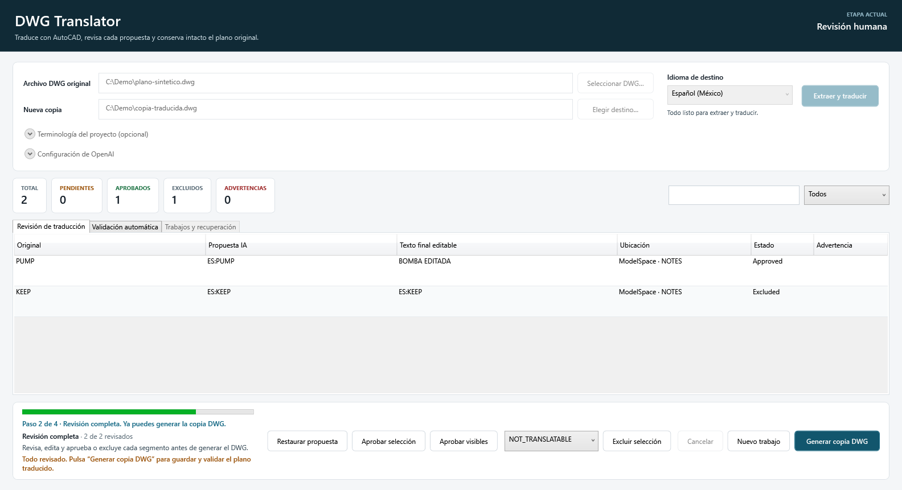
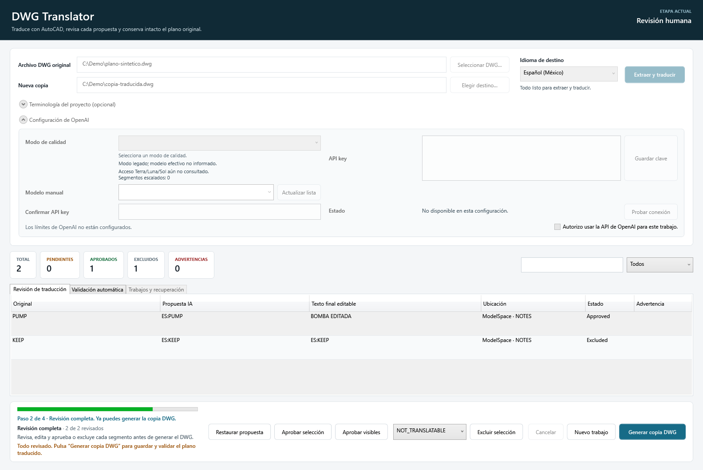
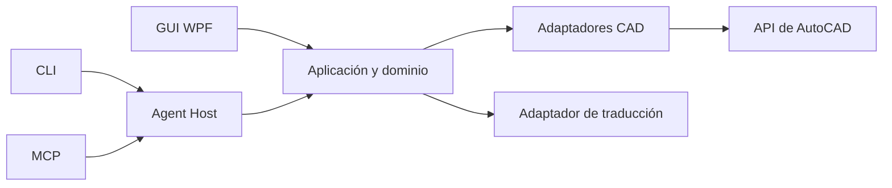

# DWG Translator

**Traducción asistida de texto en planos DWG con revisión humana y validación del resultado.**

Este repositorio es una **muestra curada de código fuente para el portafolio de Ricardo Reyes**. Presenta la arquitectura, la interfaz WPF, los contratos, el flujo de traducción y las superficies CLI/MCP. No contiene dibujos de clientes, binarios de Autodesk, credenciales, instaladores ni datos de una implementación concreta.

> **Estado de la muestra:** fuente reconstruible con pruebas y receta de empaquetado portable. Las capturas usan datos sintéticos. Para compilar los adaptadores CAD se necesitan dependencias de AutoCAD obtenidas por separado; este repositorio no distribuye AutoCAD ni un instalador.

Para reconstruir o preparar una máquina nueva, comienza por [AGENTS.md](AGENTS.md), [BUILDING.md](BUILDING.md) y la [guía de instalación](INSTALLATION.md). Estas instrucciones distinguen el paquete compilado de una instalación funcional verificada con un DWG autorizado.



*La GUI WPF muestra dos segmentos ficticios: uno aprobado y otro excluido. Las rutas visibles son ejemplos.*

<details>
<summary>Ver la configuración en la interfaz</summary>



*Vista sintética con la clave vacía; no se realizó una llamada al proveedor de traducción.*

</details>

## Qué problema aborda

El texto de un plano técnico debe traducirse sin perder la relación con la entidad CAD que lo contiene. DWG Translator separa la inspección del dibujo, las propuestas de traducción, la revisión humana y la creación de una salida distinta del original. El diseño favorece decisiones verificables y fallos explícitos cuando no puede demostrar la integridad del resultado.

El alcance inicial de escritura comprende entidades directas `TEXT` y `MTEXT`. Fields, atributos, tablas y referencias externas requieren tratamiento aparte; la muestra no los presenta como traducción de producción.

## Diseño del sistema



| Componente | Responsabilidad visible en el código |
| --- | --- |
| [Dominio y aplicación](src/DwgTranslator.Application/) | Estados del trabajo, reglas de revisión, coordinación y validación. |
| [Interfaz WPF](src/DwgTranslator.Shell/) | Selección, revisión, exclusión y seguimiento del trabajo. |
| [Lectura CAD](src/DwgTranslator.AutoCAD.ReadOnly/) y [escritura CAD](src/DwgTranslator.AutoCAD.Write/) | Integración aislada con la API de AutoCAD; el componente CAD no llama al proveedor de traducción. |
| [Traducción](src/DwgTranslator.Translation.OpenAI/) | Preparación y validación de propuestas estructuradas. |
| [Agent](src/DwgTranslator.Agent/) y [MCP](src/DwgTranslator.AgentMcp/) | Comandos y herramientas para el mismo flujo de aplicación. |
| [Contratos](contracts/v1/) | Schemas versionados para operaciones y evidencia. |

### Decisiones técnicas destacadas

- Identidad estable de segmentos para asociar propuestas con entidades CAD.
- Revisión explícita antes de escribir y exclusión deliberada de contenido fuera de alcance.
- Escritura sobre una salida nueva, seguida de reapertura y comprobaciones de integridad.
- Separación del límite CAD, la lógica de aplicación y el adaptador de traducción.
- Contratos y pruebas que comprueban casos válidos y rechazos esperados.

## Recorrido del código

- [`src/`](src/): aplicación, dominio, GUI y adaptadores.
- [`tools/DwgTranslator.AgentCli/`](tools/DwgTranslator.AgentCli/): interfaz de comandos.
- [`tools/DwgTranslator.AgentHost/`](tools/DwgTranslator.AgentHost/) y [`tools/DwgTranslator.AgentMcpServer/`](tools/DwgTranslator.AgentMcpServer/): Host y servidor MCP.
- [`tests/`](tests/): pruebas seleccionadas de lógica, Agent y MCP.
- [`fixtures/v1/`](fixtures/v1/): ejemplos sintéticos de contratos.
- [`bundle/`](bundle/): manifiestos genéricos para los adaptadores CAD de lectura y escritura.
- [`scripts/Build-Portable.ps1`](scripts/Build-Portable.ps1), [`config/`](config/), [`BUILDING.md`](BUILDING.md) e [`INSTALLATION.md`](INSTALLATION.md): compilación, paquete portable e instalación desde una copia nueva del repositorio.
- [`docs/ADR/`](docs/ADR/): decisiones de compatibilidad y empaquetado de la muestra pública.

Los proyectos CAD declaran referencias a assemblies externos de AutoCAD; esos assemblies no están incluidos. El código, los manifiestos, las dependencias NuGet fijadas y la receta de build permiten reconstruir el paquete sin depender de los archivos de una instalación anterior. La configuración y los secretos se crean en cada máquina nueva.

## Verificación de esta muestra

En la copia curada pasaron **361 pruebas**: 251 de core y contratos, 89 de Agent y 21 de MCP. La receta publicó en Release la GUI WPF, el Host, el CLI y el servidor MCP. Los dos adaptadores CAD compilaron por separado, sin advertencias, usando referencias externas disponibles en la máquina de verificación. No se ejecutó AutoCAD ni se abrió un DWG en esta comprobación.

```powershell
dotnet test tests/DwgTranslator.Core.Tests/DwgTranslator.Core.Tests.csproj -c Release
dotnet test tests/DwgTranslator.Agent.Tests/DwgTranslator.Agent.Tests.csproj -c Release
dotnet test tests/DwgTranslator.AgentMcp.Tests/DwgTranslator.AgentMcp.Tests.csproj -c Release
```

La [guía de reconstrucción](BUILDING.md) distingue entre el build aislado, el build CAD completo y la validación funcional que debe hacerse con un entorno y muestras autorizadas.

## Derechos de uso

**Copyright © 2026 Ricardo Reyes. Todos los derechos reservados.** El código se muestra para evaluación profesional. No se concede una licencia general para reutilizarlo, modificarlo o redistribuirlo. Las dependencias y marcas de terceros conservan sus propios derechos.
